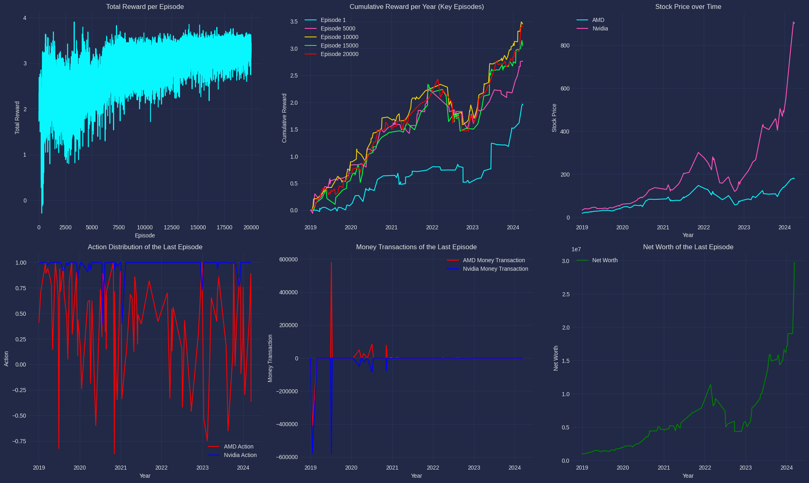

# Investigating Reinforcement Learning Approaches in Stock Market Trading

## Introduction
The financial industry and stock market analysis have been transformed by digital advancements, particularly with the rise of artificial intelligence. The semiconductor sector, crucial to the third industrial revolution, presents a compelling case study through industry leaders AMD and Nvidia. This research investigates Reinforcement Learning (RL) applications in automated stock trading, aiming to optimise investment strategies through various RL algorithms, including policy networks and deep Q-networks, with the integration of time series and deep learning.

### Project Overview
- Background and concepts needed to understand the financial investment market and modern RL algorithms.
- Data Sourcing and Pre-processing 
- RL methodologies and training processes.
- Implementation of multiple RL algorithms.
- Integration of time series and deep learning.
- Comprehensive financial performance analysis and comparison.

### Research Contributions
1. **Advanced RL Techniques**: Implementation and comparison of multiple RL approaches, especially with time series and deep learning implementation.
2. **Comprehensive Indicators**: Integration of various financial, economic, and social indicators.
3. **Practical Trading Insights**: Valuable findings for retail investors and institutions.
4. **Research Foundation**: Framework for future RL and algorithmic trading research.

## Technical Implementation
### Core Technologies
- Python
- TensorFlow/PyTorch
- OpenAI Gymnasium
- Financial APIs (Yahoo Finance, Federal Reserve Bank)

### RL Algorithms
1. **Deep Q-Learning**
   - Implementation in Simple Trader environment
   - PPO algorithm with stable-baselines3
   - Hyperparameter optimization

2. **Policy-Based Methods**
   - Policy Gradient
   - Policy Gradient with Baseline
   - Actor-Critic with Epsilon-Greedy

3. **Time Series and Deep Learning Integration**
   - ARIMA implementation
   - LSTM networks Integration
          
## Data Processing
### Data Sources
- **NVIDIA & AMD OHLCV Data (1-minute intervals, 2019-2024)**
  - Open price
  - High price
  - Low price
  - Close price
  - Trading volume
  - Shares split information calculated in

- **Financial Indices**
  - S&P 500 Index
  - NASDAQ-100 Index
  - PHLX Semiconductor Index

- **Economic Indicators**
  - Inflation Rate
  - Federal Reserve Interest Rate
  - Effective Federal Fund Rate
  - Consumer Confidence Index
  - Oil Prices
  - Gold Prices

- **Social Metrics**
  - Google Trends data for "AMD" and "Nvidia"
    
### Preprocessing  
  - Time series alignment
  - Feature engineering
  - Data normalisation
  - Gap handling

## Reinforcement Learning Environment

### OpenAI Gymnasium Implementation
The trading environment is built on OpenAI Gymnasium, customized for financial market simulation. The environment follows a Markov Decision Process (MDP), defined by the tuple $(S, A, P, R, γ)$:

#### MDP Components
- $S$: State space (market conditions, portfolio status)
- $A$: Action space (trading decisions)
- $P(s'|s,a)$: Transition probability
- $R(s'|s,a)$: Reward function
- $γ$: Discount factor (0 < γ < 1)

#### Environment Structure
1. **Action Space**
   - Continuous vectors for trading decisions
   - Range: [-1, 1] for position sizing
   - Action interpretation:
     - Positive: Buy order
     - Negative: Sell order
     - Zero: Hold position

2. **Observation Space**
   - Multi-dimensional market data array
   - Features:
     - OHLCV data
     - Economic indicators
     - Technical indicators
     - Sentiment metrics

3. **Initial Conditions**
   - Starting balance: $1,000,000
   - Zero initial positions
     
### Trading Agent Implementation
#### Simple Trader
- **Actions**: Buy/Sell/Hold with fixed 5% allocation
- **Decision Logic**:
  - Buy: Purchase 5% of current balance
  - Sell: Liquidate 5% of held shares
  - Hold: No action
- **Purpose**: Baseline performance benchmark

#### Complex Trader
- **Continuous Action Space**: [-1, 1]
- **Decision Logic**:
  - Positive value (0 to 1): Buy a proportional amount
  - Negative value (-1 to 0): Sell a proportional amount
  - Zero: Hold position
- **Position Sizing**: Dynamic allocation based on model output
- **Advanced Features**: Risk management, position scaling

## Training Strategy
The training process was carefully designed to ensure optimal model performance and learning efficiency:

### Grid Search Optimization
- **Hyperparameters Explored**:
  - Number of steps per episode
  - Batch size
  - Learning rate
- **Optimization Goal**: Maximize average reward across training runs
- **Validation Process**: 100 episodes with 100 steps each

### Full Training Implementation
- **Duration**: 20,000 episodes
- **Episode Length**: 100 steps per episode
- **Data Sampling**: Random selection from AMD and Nvidia stock data
- **Diversification**: Varied market conditions and scenarios

## Evaluation Metrics

### 1. Cumulative Return
Calculated as: (Final Net Worth / Initial Net Worth) - 1
- Measures the total percentage return over the investment period
- Direct indicator of strategy's absolute performance

### 2. Sharpe Ratio
Calculated as: (Portfolio Return - Risk-free Rate) / Portfolio Standard Deviation
- Evaluates risk-adjusted returns
- Higher values indicate better risk-adjusted performance

### 3. Maximum Drawdown
Calculated as: (Peak Net Worth - Trough Net Worth) / Peak Net Worth
- Measures the largest peak-to-trough decline
- Key risk assessment metric

### 4. Hit Ratio
Calculated as: Number of Profitable Trades / Total Number of Trades
- Measures trading accuracy and consistency
- Higher ratios indicate a more reliable strategy

## Model Performance Comparison

| Model Type | Environment | Return (%) | Sharpe Ratio | Max Drawdown ($M) | Hit Ratio |
|------------|------------|------------|--------------|-------------------|-----------|
| LSTM Enhanced Policy Gradient | Complex Trader | 2926.10 | 5.57 | 7.04 | 0.69 |
| Policy Network with Baseline | Complex Trader | 1529.99 | 5.06 | 6.10 | 0.63 |
| Actor-Critic with Epsilon-Greedy | Complex Trader | 916.00 | 4.17 | 4.22 | 0.57 | 
| Deep Q-Learning | Simple Trader | 734.60 | 4.64 | 3.25 | 0.60 |
| ARIMA Enhanced Policy Network | Complex Trader | 885.61 | 4.25 | 5.09 | 0.52 |

### LSTM-Enhanced Model Performance Analysis

## Summary of Findings
The research demonstrates the effectiveness of combining sophisticated RL algorithms with deep learning methodologies for stock trading. Key achievements include:

1. **Superior Performance**: LSTM-enhanced Policy Networks achieved highest returns (2926.10%) and Sharpe ratio (5.57)
2. **Enhanced Decision Making**: Successful integration of comprehensive indicators spanning financial, economic, and social factors
3. **Active Strategy**: Effective exploration strategies and no-action penalties promoted consistent performance
4. **Robust Framework**: Established foundation for future RL applications in stock trading

## Future Work
1. **Real-time Data Integration**: Enhance model adaptability and responsiveness
2. **Sophisticated Risk Management**: Develop advanced loss mitigation strategies
3. **Diverse Financial Instruments**: Expand to options and futures trading
4. **Computational Efficiency**: Optimize for larger datasets
5. **Ethical Considerations**: Ensure fair and responsible trading practices

